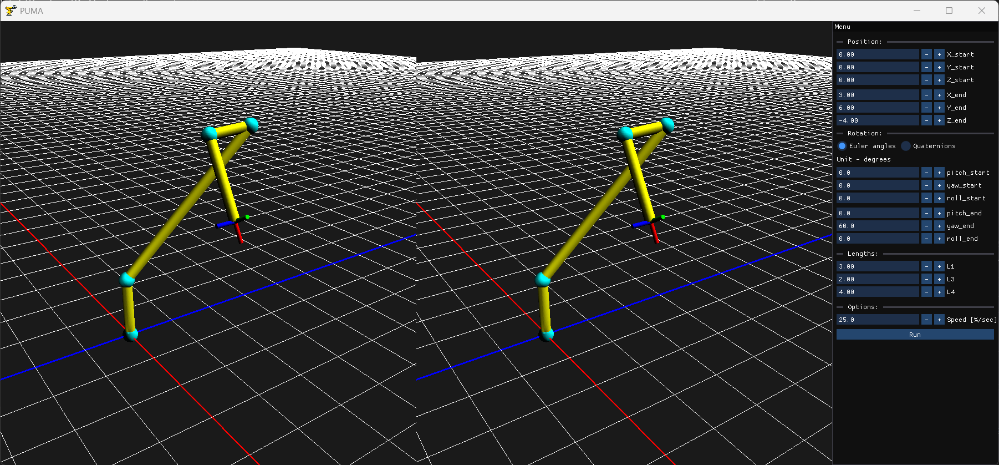

# PUMA
The program was developed as part of the course 'Programming of Numerically Controlled Equipment'.

Software simulates 3D motion of a Puma robot using inverse kinematics (geometric or analytical). Features include:
- Dual animation: joint space & end-effector space (quaternion interpolation)
- Interactive 3D visualization with full robot model
- Time-based animation, independent of system performance
- User-defined start/end poses and animation duration

## Stack
Here is the stack used to develop this piece of software:
### Main:
- C++
- OpenGL (GLSL)
### Dependencies:
- ImGui - UI
- GLFW - windowing
- GLM - math
